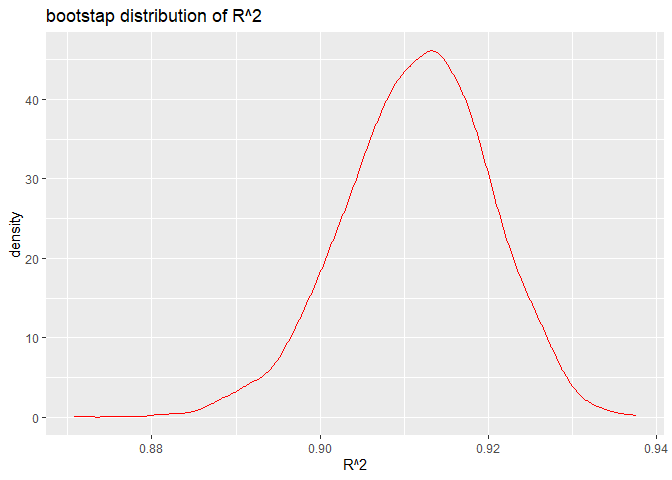
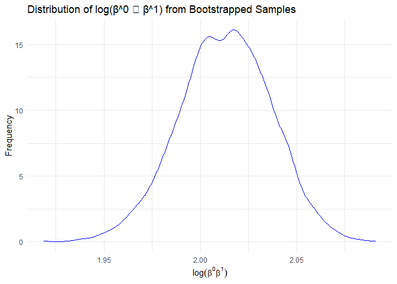
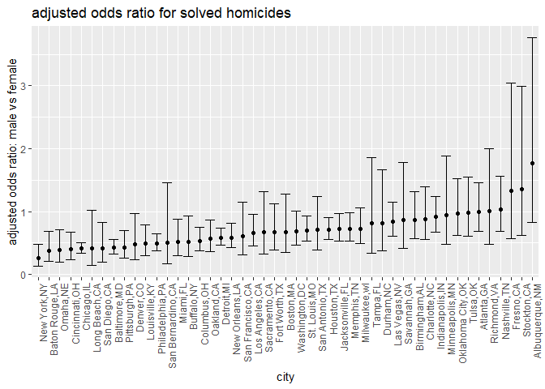
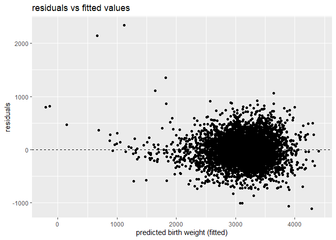
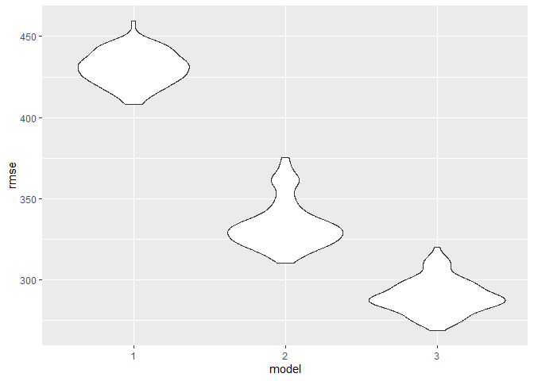

hw6
================
Senna
2024-11-30

Necessary packages are loaded.

``` r
library(tidyverse)
library(broom)
library(ggplot2)
library(purrr)
library(modelr)
library(rsample)

set.seed(123)
```

## Problem 1

``` r
weather_df = 
  rnoaa::meteo_pull_monitors(
    c("USW00094728"),
    var = c("PRCP", "TMIN", "TMAX"), 
    date_min = "2017-01-01",
    date_max = "2017-12-31") %>%
  mutate(
    name = recode(id, USW00094728 = "CentralPark_NY"),
    tmin = tmin / 10,
    tmax = tmax / 10) %>%
  select(name, id, everything())
```

    ## using cached file: C:\Users\Senna\AppData\Local/R/cache/R/rnoaa/noaa_ghcnd/USW00094728.dly

    ## date created (size, mb): 2024-11-29 22:07:49.313665 (8.685)

    ## file min/max dates: 1869-01-01 / 2024-11-30

``` r
boot_weather = weather_df |> 
  bootstrap(n = 5000) |> 
  mutate(
    models = map(strap, \(df) lm(tmax ~ tmin, data = df)),
    glance_results = map(models, broom::glance),
    tidy_results = map(models, broom::tidy)
  ) |> 
  select(-strap, -models) |> 
  unnest(cols = c(glance_results, tidy_results), names_sep = "_") 


boot_weather|> 
  summarize(
    r_squared_mean = mean(glance_results_r.squared, na.rm = TRUE),
    r_squared_lower_ci = quantile(glance_results_r.squared, 0.025, na.rm = TRUE),
    r_squared_upper_ci = quantile(glance_results_r.squared, 0.975, na.rm = TRUE),
    log_product = ifelse(
      all(c("(Intercept)", "tmin") %in% tidy_results_term),
      tidy_results_estimate[tidy_results_term == "(Intercept)"] * 
      tidy_results_estimate[tidy_results_term == "tmin"],
      NA_real_
    ),
    log_product_mean = mean(log(log_product), na.rm = TRUE),
    log_product_lower_ci = quantile(log(log_product), 0.025, na.rm = TRUE),
    log_product_upper_ci = quantile(log(log_product), 0.975, na.rm = TRUE)
  )|>
   knitr::kable(
    format = "pipe",
    caption = "Summary of Regression Model Statistics"
  )
```

| r_squared_mean | r_squared_lower_ci | r_squared_upper_ci | log_product | log_product_mean | log_product_lower_ci | log_product_upper_ci |
|---:|---:|---:|---:|---:|---:|---:|
| 0.9115107 | 0.8945701 | 0.9271042 | 7.836235 | 2.058759 | 2.058759 | 2.058759 |

Summary of Regression Model Statistics

``` r
boot_results = boot_weather|>
  filter(tidy_results_term %in% c("(Intercept)", "tmin")) |> 
  group_by(glance_results_r.squared) |> 
  summarize(
    r_squared = glance_results_r.squared,
    log_product = log(
      tidy_results_estimate[tidy_results_term == "(Intercept)"] *
      tidy_results_estimate[tidy_results_term == "tmin"]
    )
  )
```

    ## Warning: Returning more (or less) than 1 row per `summarise()` group was deprecated in
    ## dplyr 1.1.0.
    ## ℹ Please use `reframe()` instead.
    ## ℹ When switching from `summarise()` to `reframe()`, remember that `reframe()`
    ##   always returns an ungrouped data frame and adjust accordingly.
    ## Call `lifecycle::last_lifecycle_warnings()` to see where this warning was
    ## generated.

    ## `summarise()` has grouped output by 'glance_results_r.squared'. You can
    ## override using the `.groups` argument.

###### r2 plot

``` r
ggplot(boot_results, aes(x = r_squared)) +
  geom_density (color ='red', alpha = 0.5)+
  theme_minimal() +
  labs(
    title = "Distribution of R^2 from Bootstrapped Samples",
    x = expression(R^2),
    y = "Frequency"
  )
```

<!-- -->

###### log product plot

``` r
ggplot(boot_results, aes(x = log_product)) +
  geom_density (color ='blue', alpha = 0.5)+
  theme_minimal() +
  labs(
    title = "Distribution of log(β^0 ∗ β^1) from Bootstrapped Samples",
    x = expression(log(beta^0 * beta^1)),
    y = "Frequency"
  )
```

<!-- -->

The log product follows a normal distribution. We had n=5000 for
bootstrapping, which is a large sample size. This invokes the Central
Limit Theorem.

r^2 plot shows a left skew. r^2 values are bounded between 0 and 1, and
in our case, the estimate is close to 1.

## Problem 2

``` r
homicide_df = read.csv("./data/homicide-data.csv")|>
  mutate(
    city_state = paste(city, state, sep=","),
    solved = if_else(disposition == "Closed by arrest",1,0),
    victim_age = as.numeric(victim_age),
    victim_sex = as.factor(victim_sex),
    victim_race = as.factor(victim_race),
    solved = as.factor(solved)
  )
```

    ## Warning: There was 1 warning in `mutate()`.
    ## ℹ In argument: `victim_age = as.numeric(victim_age)`.
    ## Caused by warning:
    ## ! NAs introduced by coercion

``` r
filtered = homicide_df|>
  filter(
    !city_state %in% c("Dallas,TX", "Phoenix,AZ", "Kansas City,MO", "Tulsa,AL"),
    victim_race %in% c("White", "Black"),
    !is.na(victim_age)
  )
```

``` r
baltimore_df = filtered |>
  filter(city_state == "Baltimore,MD")

baltimore_model = glm(
  solved ~ victim_age + victim_sex + victim_race,
  family = binomial,
  data = baltimore_df
)

baltimore_results = tidy(baltimore_model, conf.int = TRUE, exp = TRUE)

sex_diff = baltimore_results|>
  filter (term == "victim_sexMale")|>
  select(estimate = estimate, conf.low, conf.high)|>
   knitr::kable(
    format = "pipe"
  )

print(sex_diff)
```

    ## 
    ## 
    ## |  estimate|  conf.low| conf.high|
    ## |---------:|---------:|---------:|
    ## | 0.4255117| 0.3241908| 0.5575508|

``` r
city_model = filtered|>
  group_by(city_state)|>
  nest()|>
  mutate(
    model = map(data, ~glm(solved ~ victim_age + victim_sex + victim_race, family = binomial, data = .x)),
    results = map(model, ~tidy(.x, conf.int = TRUE, exp = TRUE))
  )|>
  unnest(results)|>
  filter(term == "victim_sexMale")|>
  select(city_state, estimate = estimate, conf.low, conf.high)
```

    ## Warning: There were 43 warnings in `mutate()`.
    ## The first warning was:
    ## ℹ In argument: `results = map(model, ~tidy(.x, conf.int = TRUE, exp = TRUE))`.
    ## ℹ In group 1: `city_state = "Albuquerque,NM"`.
    ## Caused by warning:
    ## ! glm.fit: fitted probabilities numerically 0 or 1 occurred
    ## ℹ Run `dplyr::last_dplyr_warnings()` to see the 42 remaining warnings.

``` r
city_model|>
   knitr::kable(
    format = "pipe"
  )
```

| city_state        |  estimate |  conf.low | conf.high |
|:------------------|----------:|----------:|----------:|
| Albuquerque,NM    | 1.7674995 | 0.8247081 | 3.7618600 |
| Atlanta,GA        | 1.0000771 | 0.6803477 | 1.4582575 |
| Baltimore,MD      | 0.4255117 | 0.3241908 | 0.5575508 |
| Baton Rouge,LA    | 0.3814393 | 0.2043481 | 0.6836343 |
| Birmingham,AL     | 0.8700153 | 0.5713814 | 1.3138409 |
| Boston,MA         | 0.6739912 | 0.3534469 | 1.2768225 |
| Buffalo,NY        | 0.5205704 | 0.2884416 | 0.9358300 |
| Charlotte,NC      | 0.8838976 | 0.5507440 | 1.3905954 |
| Chicago,IL        | 0.4100982 | 0.3361233 | 0.5008546 |
| Cincinnati,OH     | 0.3998277 | 0.2313767 | 0.6670456 |
| Columbus,OH       | 0.5324845 | 0.3770457 | 0.7479124 |
| Denver,CO         | 0.4790620 | 0.2327380 | 0.9624974 |
| Detroit,MI        | 0.5823472 | 0.4619454 | 0.7335458 |
| Durham,NC         | 0.8123514 | 0.3824420 | 1.6580169 |
| Fort Worth,TX     | 0.6689803 | 0.3935128 | 1.1211603 |
| Fresno,CA         | 1.3351647 | 0.5672553 | 3.0475080 |
| Houston,TX        | 0.7110264 | 0.5569844 | 0.9057376 |
| Indianapolis,IN   | 0.9187284 | 0.6784616 | 1.2413059 |
| Jacksonville,FL   | 0.7198144 | 0.5359236 | 0.9650986 |
| Las Vegas,NV      | 0.8373078 | 0.6058830 | 1.1510854 |
| Long Beach,CA     | 0.4102163 | 0.1427304 | 1.0241775 |
| Los Angeles,CA    | 0.6618816 | 0.4565014 | 0.9541036 |
| Louisville,KY     | 0.4905546 | 0.3014879 | 0.7836391 |
| Memphis,TN        | 0.7232194 | 0.5261210 | 0.9835973 |
| Miami,FL          | 0.5152379 | 0.3040214 | 0.8734480 |
| Milwaukee,wI      | 0.7271327 | 0.4951325 | 1.0542297 |
| Minneapolis,MN    | 0.9469587 | 0.4759016 | 1.8809745 |
| Nashville,TN      | 1.0342379 | 0.6807452 | 1.5559966 |
| New Orleans,LA    | 0.5849373 | 0.4218807 | 0.8121787 |
| New York,NY       | 0.2623978 | 0.1327512 | 0.4850117 |
| Oakland,CA        | 0.5630819 | 0.3637421 | 0.8671086 |
| Oklahoma City,OK  | 0.9740747 | 0.6228507 | 1.5199721 |
| Omaha,NE          | 0.3824861 | 0.1988357 | 0.7109316 |
| Philadelphia,PA   | 0.4962756 | 0.3760120 | 0.6498797 |
| Pittsburgh,PA     | 0.4307528 | 0.2626022 | 0.6955518 |
| Richmond,VA       | 1.0060520 | 0.4834671 | 1.9936248 |
| San Antonio,TX    | 0.7046200 | 0.3928179 | 1.2382509 |
| Sacramento,CA     | 0.6688418 | 0.3262733 | 1.3143888 |
| Savannah,GA       | 0.8669817 | 0.4185827 | 1.7802453 |
| San Bernardino,CA | 0.5003444 | 0.1655367 | 1.4623977 |
| San Diego,CA      | 0.4130248 | 0.1913527 | 0.8301847 |
| San Francisco,CA  | 0.6075362 | 0.3116925 | 1.1551470 |
| St. Louis,MO      | 0.7031665 | 0.5298505 | 0.9319005 |
| Stockton,CA       | 1.3517273 | 0.6256427 | 2.9941299 |
| Tampa,FL          | 0.8077029 | 0.3395253 | 1.8598834 |
| Tulsa,OK          | 0.9757694 | 0.6090664 | 1.5439356 |
| Washington,DC     | 0.6901713 | 0.4653608 | 1.0122516 |

``` r
ordered_results = city_model|> arrange(estimate)

ggplot(ordered_results, aes(x= reorder(city_state, estimate), y = estimate))+
  geom_point()+
  geom_errorbar(aes(ymin = conf.low, ymax = conf.high))+
  labs(
    title = "adjusted odds ratio for solved homicides",
    x = "city",
    y = "adjusted odds ratio: male vs female"
  )+
  theme(
    axis.text.x = element_text(angle = 90, hjust = 1)  
  )
```

<!-- --> An adjusted
odds ratio greater than 1 indicates that male victims are more likely to
have their homicides solved compared to female victims. The adjusted
odds ratios vary across cities. Cities with the error bars not crossing
1 suggest a significant difference in male and female victims’ homicide
being solved. If the error bar crosses 1, there is no significant
difference.

For instance, cities such as New York, San Antonio, Detroit and more
show that female victims are more likely to have their homicides solved.
Cities such as Philadelphia and Atlanta show no signicifant difference.
None of the cities show that male victims are more likley to have their
homicides solved.

## Problem 3

``` r
bw_df = read.csv("./data/birthweight.csv")|>
  mutate(
    babysex = factor(babysex, labels = c("Male", "Female")),
    frace = factor(frace, levels = c(1, 2, 3, 4, 8, 9), 
                   labels = c("White", "Black", "Asian", "Puerto Rican", "Other", "Unknown")),
    mrace = factor(mrace, levels = c(1, 2, 3, 4, 8), 
                   labels = c("White", "Black", "Asian", "Puerto Rican", "Other")),
    malform = factor(malform, levels = c(0, 1), labels = c("Absent", "Present"))
  )
```

mother’s age, gestational age, mother’s pre-pregnancy BMI, mother’s
weight gain, and father’s income are retained in my model because they
are strong, well-established predictors of birthweight. Father’s and
mother’s race are also included to account for socioeconomic and
healthcare access differences. Father’s race and income could be
related, therefore I will add them as an interaction term. Malformation
is included because they directly affect birthweight by influencing
fetal development.

``` r
bwt_model <- lm(bwt ~  delwt + momage + gaweeks + ppbmi + wtgain + fincome*frace  + mrace + malform,  data = bw_df)

summary(bwt_model)
```

    ## 
    ## Call:
    ## lm(formula = bwt ~ delwt + momage + gaweeks + ppbmi + wtgain + 
    ##     fincome * frace + mrace + malform, data = bw_df)
    ## 
    ## Residuals:
    ##     Min      1Q  Median      3Q     Max 
    ## -1641.7  -264.9     9.7   277.5  1436.7 
    ## 
    ## Coefficients:
    ##                            Estimate Std. Error t value Pr(>|t|)    
    ## (Intercept)                390.4922   100.1038   3.901 9.73e-05 ***
    ## delwt                        7.4596     0.6445  11.575  < 2e-16 ***
    ## momage                       0.5394     1.8886   0.286  0.77517    
    ## gaweeks                     52.7598     2.1409  24.644  < 2e-16 ***
    ## ppbmi                      -20.4736     4.0605  -5.042 4.79e-07 ***
    ## wtgain                       2.2742     0.9036   2.517  0.01187 *  
    ## fincome                      0.9375     0.3531   2.655  0.00796 ** 
    ## fraceBlack                 -52.6714    76.8526  -0.685  0.49316    
    ## fraceAsian                 116.3212   164.9916   0.705  0.48084    
    ## fracePuerto Rican          -27.5280   103.5112  -0.266  0.79030    
    ## fraceOther                -209.2910   195.7841  -1.069  0.28513    
    ## mraceBlack                -118.4771    72.9381  -1.624  0.10437    
    ## mraceAsian                  23.7555   113.9081   0.209  0.83481    
    ## mracePuerto Rican          -25.1365    71.3597  -0.352  0.72467    
    ## malformPresent             -66.2429   111.4221  -0.595  0.55219    
    ## fincome:fraceBlack          -1.6103     0.5874  -2.742  0.00614 ** 
    ## fincome:fraceAsian          -3.2522     2.9711  -1.095  0.27375    
    ## fincome:fracePuerto Rican   -0.3299     1.9529  -0.169  0.86585    
    ## fincome:fraceOther           5.5515     4.7160   1.177  0.23919    
    ## ---
    ## Signif. codes:  0 '***' 0.001 '**' 0.01 '*' 0.05 '.' 0.1 ' ' 1
    ## 
    ## Residual standard error: 430.2 on 4323 degrees of freedom
    ## Multiple R-squared:  0.2975, Adjusted R-squared:  0.2946 
    ## F-statistic: 101.7 on 18 and 4323 DF,  p-value: < 2.2e-16

``` r
bw_df = bw_df |>
  add_predictions(bwt_model)|>
  add_residuals(bwt_model)

ggplot(bw_df, aes(x=pred, y=resid))+
  geom_point()+
  geom_hline(yintercept=0, linetype = 'dashed')+
  labs(
    title = "residuals vs fitted values",
    x = "predicted birth weight (fitted)",
    y = "residuals"
  )
```

<!-- -->

The two models being compared to my proposed model are denoted as model2
and model3 respectively in the code below.

``` r
cv_df = 
  crossv_mc(bw_df, 100)

cv_df =cv_df |> 
  mutate(
    train = map(train, as_tibble),
    test = map(test, as_tibble))
```

``` r
cv_df = cv_df |> 
  mutate(
    model1  = map(train, \(df) lm(bwt ~ babysex + delwt + momage + gaweeks + ppbmi + wtgain + fincome + frace + mrace + malform, data = df)),
    model2  = map(train, \(df) lm(bwt ~ blength + gaweeks, data = df)),
    model3  = map(train, \(df) lm(bwt ~ bhead + blength + babysex + bhead*blength + bhead*babysex + blength*babysex + bhead * blength * babysex, data = df))) |> 
  mutate(
    rmse_1 = map2_dbl(model1, test, \(mod, df) rmse(model = mod, data = df)),
    rmse_2 = map2_dbl(model2, test, \(mod, df) rmse(model = mod, data = df)),
    rmse_3 = map2_dbl(model3, test, \(mod, df) rmse(model = mod, data = df)))
```

``` r
cv_df |> 
  select(starts_with("rmse")) |> 
  pivot_longer(
    everything(),
    names_to = "model", 
    values_to = "rmse",
    names_prefix = "rmse_") |> 
  mutate(model = fct_inorder(model)) |> 
  ggplot(aes(x = model, y = rmse)) + geom_violin()
```

<!-- -->
