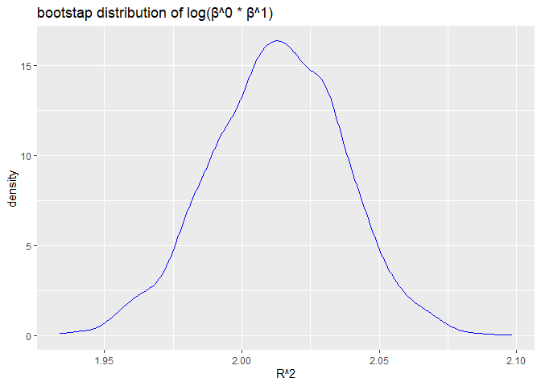

hw6
================
Senna
2024-11-30

``` r
library(tidyverse)
```

    ## ── Attaching core tidyverse packages ──────────────────────── tidyverse 2.0.0 ──
    ## ✔ dplyr     1.1.4     ✔ readr     2.1.5
    ## ✔ forcats   1.0.0     ✔ stringr   1.5.1
    ## ✔ ggplot2   3.5.1     ✔ tibble    3.2.1
    ## ✔ lubridate 1.9.3     ✔ tidyr     1.3.1
    ## ✔ purrr     1.0.2     
    ## ── Conflicts ────────────────────────────────────────── tidyverse_conflicts() ──
    ## ✖ dplyr::filter() masks stats::filter()
    ## ✖ dplyr::lag()    masks stats::lag()
    ## ℹ Use the conflicted package (<http://conflicted.r-lib.org/>) to force all conflicts to become errors

``` r
library(broom)
library(ggplot2)
library(purrr)
```

## Problem 1

``` r
weather_df = 
  rnoaa::meteo_pull_monitors(
    c("USW00094728"),
    var = c("PRCP", "TMIN", "TMAX"), 
    date_min = "2017-01-01",
    date_max = "2017-12-31") %>%
  mutate(
    name = recode(id, USW00094728 = "CentralPark_NY"),
    tmin = tmin / 10,
    tmax = tmax / 10) %>%
  select(name, id, everything())
```

    ## using cached file: C:\Users\Senna\AppData\Local/R/cache/R/rnoaa/noaa_ghcnd/USW00094728.dly

    ## date created (size, mb): 2024-11-29 22:07:49.313665 (8.685)

    ## file min/max dates: 1869-01-01 / 2024-11-30

``` r
n_boot = 5000

boot_results = replicate (n_boot, {
  sample = weather_df %>% sample_frac(replace = TRUE) #why true?
  
  model = lm(tmax ~tmin, data= sample)
  
  r_sqr = glance(model)$r.squared
  
  coefs = tidy(model)
  log_beta = log(coefs$estimate[1] * coefs$estimate[2])
  
  c(r_sqr, log_beta)
  
}, simplify = "matrix")

boot_results = t(boot_results)
colnames(boot_results) = c("r_sqr", "log_beta")

bootstrap_df = as.data.frame(boot_results)
```

``` r
ci_r_sqr = quantile(bootstrap_df$r_sqr, probs = c(0.025,0.975))
ci_log_beta = quantile(bootstrap_df$log_beta, probs = c(0.025, 0.975))

print("95% CI for R^2:")
```

    ## [1] "95% CI for R^2:"

``` r
print(ci_r_sqr)
```

    ##      2.5%     97.5% 
    ## 0.8931807 0.9273063

``` r
print("95% CI for log(β^0 * β^1):")
```

    ## [1] "95% CI for log(β^0 * β^1):"

``` r
print(ci_log_beta)
```

    ##     2.5%    97.5% 
    ## 1.966575 2.059841

``` r
ggplot(bootstrap_df, aes(x = r_sqr))+
  geom_density (color ='red', alpha = 0.5)+
  labs(title = "bootstap distribution of R^2", x="R^2", y="density")
```

<!-- -->

``` r
ggplot(bootstrap_df, aes(x = log_beta))+
  geom_density (color='blue',alpha = 0.5)+
  labs(title = "bootstap distribution of log(β^0 * β^1)", x="R^2", y="density")
```

<!-- -->

## Problem 2

``` r
homicide_df = read.csv("./data/homicide-data.csv")|>
  mutate(
    city_state = paste(city, state, sep=","),
    solved = if_else(disposition == "Closed by arrest",1,0),
    victim_age = as.numeric(victim_age),
    victim_sex = as.factor(victim_sex),
    victim_race = as.factor(victim_race),
    solved = as.factor(solved)
  )
```

    ## Warning: There was 1 warning in `mutate()`.
    ## ℹ In argument: `victim_age = as.numeric(victim_age)`.
    ## Caused by warning:
    ## ! NAs introduced by coercion

``` r
filtered = homicide_df|>
  filter(
    !city_state %in% c("Dallas, TX", "Phoenix, AZ", "Kansas City, MO", "Tulsa, AL"),
    victim_race %in% c("White", "Black"),
    !is.na(victim_age)
  )
```

``` r
baltimore_df = filtered |>
  filter(city_state == "Baltimore,MD")

baltimore_model = glm(
  solved ~ victim_age + victim_sex + victim_race,
  family = binomial,
  data = baltimore_df
)

baltimore_results = tidy(baltimore_model, conf.int = TRUE, exp = TRUE) # true true?

sex_diff = baltimore_results|>
  filter (term == "victim_sexMale")|>
  select(estimate = estimate, conf.low, conf.high)

print(sex_diff)
```

    ## # A tibble: 1 × 3
    ##   estimate conf.low conf.high
    ##      <dbl>    <dbl>     <dbl>
    ## 1    0.426    0.324     0.558

``` r
city_model = filtered|>
  group_by(city_state)|>
   filter(
    n_distinct(victim_sex) > 1,  
    n_distinct(victim_race) > 1   
  ) |>
  nest()|>
  mutate(
    model = map(data, ~glm(solved ~ victim_age + victim_sex + victim_race, family = binomial, data = .x)),
    results = map(model, ~tidy(.x, conf.int = TRUE, exp = TRUE))
  )|>
  unnest(results)|>
  filter(term == "victim_sexMale")|>
  select(city_state, estimate = estimate, conf.low, conf.high)
```

    ## Warning: There were 43 warnings in `mutate()`.
    ## The first warning was:
    ## ℹ In argument: `results = map(model, ~tidy(.x, conf.int = TRUE, exp = TRUE))`.
    ## ℹ In group 1: `city_state = "Albuquerque,NM"`.
    ## Caused by warning:
    ## ! glm.fit: fitted probabilities numerically 0 or 1 occurred
    ## ℹ Run `dplyr::last_dplyr_warnings()` to see the 42 remaining warnings.

``` r
ordered_results = city_model|> arrange(estimate)

ggplot(ordered_results, aes(x= reorder(city_state, estimate), y = estimate))+
  geom_point()+
  geom_errorbar(aes(ymin = conf.low, ymax = conf.high))+
  labs(
    title = "adjusted odds ratio for solved homicides",
    x = "city",
    y = "adjusted odds ratio: male vs female"
  )+
  theme(
    axis.text.x = element_text(angle = 90, hjust = 1)  
  )
```

<!-- --> COMMENT ON THE
PLOT
