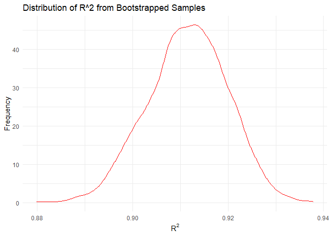
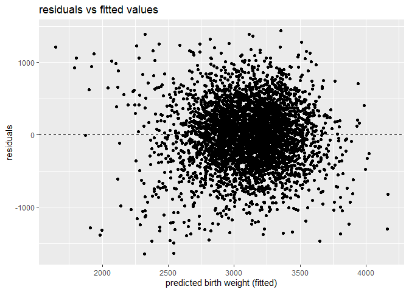

hw6
================
Senna
2024-11-30

``` r
library(tidyverse)
```

    ## ── Attaching core tidyverse packages ──────────────────────── tidyverse 2.0.0 ──
    ## ✔ dplyr     1.1.4     ✔ readr     2.1.5
    ## ✔ forcats   1.0.0     ✔ stringr   1.5.1
    ## ✔ ggplot2   3.5.1     ✔ tibble    3.2.1
    ## ✔ lubridate 1.9.3     ✔ tidyr     1.3.1
    ## ✔ purrr     1.0.2     
    ## ── Conflicts ────────────────────────────────────────── tidyverse_conflicts() ──
    ## ✖ dplyr::filter() masks stats::filter()
    ## ✖ dplyr::lag()    masks stats::lag()
    ## ℹ Use the conflicted package (<http://conflicted.r-lib.org/>) to force all conflicts to become errors

``` r
library(broom)
library(ggplot2)
library(purrr)
library(modelr)
```

    ## Warning: package 'modelr' was built under R version 4.4.2

    ## 
    ## Attaching package: 'modelr'
    ## 
    ## The following object is masked from 'package:broom':
    ## 
    ##     bootstrap

``` r
library(rsample)
```

    ## Warning: package 'rsample' was built under R version 4.4.2

## Problem 1

``` r
weather_df = 
  rnoaa::meteo_pull_monitors(
    c("USW00094728"),
    var = c("PRCP", "TMIN", "TMAX"), 
    date_min = "2017-01-01",
    date_max = "2017-12-31") %>%
  mutate(
    name = recode(id, USW00094728 = "CentralPark_NY"),
    tmin = tmin / 10,
    tmax = tmax / 10) %>%
  select(name, id, everything())
```

    ## using cached file: C:\Users\Senna\AppData\Local/R/cache/R/rnoaa/noaa_ghcnd/USW00094728.dly

    ## date created (size, mb): 2024-11-29 22:07:49.313665 (8.685)

    ## file min/max dates: 1869-01-01 / 2024-11-30

``` r
n_boot = 5000

boot_results = replicate (n_boot, {
  sample = weather_df %>% sample_frac(replace = TRUE) #why true?
  
  model = lm(tmax ~tmin, data= sample)
  
  r_sqr = glance(model)$r.squared
  
  coefs = tidy(model)
  log_beta = log(coefs$estimate[1] * coefs$estimate[2])
  
  c(r_sqr, log_beta)
  
}, simplify = "matrix")

boot_results = t(boot_results)
colnames(boot_results) = c("r_sqr", "log_beta")

bootstrap_df = as.data.frame(boot_results)
```

``` r
ci_r_sqr = quantile(bootstrap_df$r_sqr, probs = c(0.025,0.975))
ci_log_beta = quantile(bootstrap_df$log_beta, probs = c(0.025, 0.975))

print("95% CI for R^2:")
```

    ## [1] "95% CI for R^2:"

``` r
print(ci_r_sqr)
```

    ##      2.5%     97.5% 
    ## 0.8935250 0.9274094

``` r
print("95% CI for log(β^0 * β^1):")
```

    ## [1] "95% CI for log(β^0 * β^1):"

``` r
print(ci_log_beta)
```

    ##     2.5%    97.5% 
    ## 1.963406 2.059195

``` r
ggplot(bootstrap_df, aes(x = r_sqr))+
  geom_density (color ='red', alpha = 0.5)+
  labs(title = "bootstap distribution of R^2", x="R^2", y="density")
```

<!-- -->

``` r
ggplot(bootstrap_df, aes(x = log_beta))+
  geom_density (color='blue',alpha = 0.5)+
  labs(title = "bootstap distribution of log(β^0 * β^1)", x="R^2", y="density")
```

<!-- -->

## Problem 2

``` r
homicide_df = read.csv("./data/homicide-data.csv")|>
  mutate(
    city_state = paste(city, state, sep=","),
    solved = if_else(disposition == "Closed by arrest",1,0),
    victim_age = as.numeric(victim_age),
    victim_sex = as.factor(victim_sex),
    victim_race = as.factor(victim_race),
    solved = as.factor(solved)
  )
```

    ## Warning: There was 1 warning in `mutate()`.
    ## ℹ In argument: `victim_age = as.numeric(victim_age)`.
    ## Caused by warning:
    ## ! NAs introduced by coercion

``` r
filtered = homicide_df|>
  filter(
    !city_state %in% c("Dallas, TX", "Phoenix, AZ", "Kansas City, MO", "Tulsa, AL"),
    victim_race %in% c("White", "Black"),
    !is.na(victim_age)
  )
```

``` r
baltimore_df = filtered |>
  filter(city_state == "Baltimore,MD")

baltimore_model = glm(
  solved ~ victim_age + victim_sex + victim_race,
  family = binomial,
  data = baltimore_df
)

baltimore_results = tidy(baltimore_model, conf.int = TRUE, exp = TRUE) # true true?

sex_diff = baltimore_results|>
  filter (term == "victim_sexMale")|>
  select(estimate = estimate, conf.low, conf.high)

print(sex_diff)
```

    ## # A tibble: 1 × 3
    ##   estimate conf.low conf.high
    ##      <dbl>    <dbl>     <dbl>
    ## 1    0.426    0.324     0.558

``` r
city_model = filtered|>
  group_by(city_state)|>
   filter(
    n_distinct(victim_sex) > 1,  
    n_distinct(victim_race) > 1   
  ) |>
  nest()|>
  mutate(
    model = map(data, ~glm(solved ~ victim_age + victim_sex + victim_race, family = binomial, data = .x)),
    results = map(model, ~tidy(.x, conf.int = TRUE, exp = TRUE))
  )|>
  unnest(results)|>
  filter(term == "victim_sexMale")|>
  select(city_state, estimate = estimate, conf.low, conf.high)
```

    ## Warning: There were 43 warnings in `mutate()`.
    ## The first warning was:
    ## ℹ In argument: `results = map(model, ~tidy(.x, conf.int = TRUE, exp = TRUE))`.
    ## ℹ In group 1: `city_state = "Albuquerque,NM"`.
    ## Caused by warning:
    ## ! glm.fit: fitted probabilities numerically 0 or 1 occurred
    ## ℹ Run `dplyr::last_dplyr_warnings()` to see the 42 remaining warnings.

``` r
ordered_results = city_model|> arrange(estimate)

ggplot(ordered_results, aes(x= reorder(city_state, estimate), y = estimate))+
  geom_point()+
  geom_errorbar(aes(ymin = conf.low, ymax = conf.high))+
  labs(
    title = "adjusted odds ratio for solved homicides",
    x = "city",
    y = "adjusted odds ratio: male vs female"
  )+
  theme(
    axis.text.x = element_text(angle = 90, hjust = 1)  
  )
```

<!-- --> COMMENT ON THE
PLOT

## Problem 3

``` r
bw_df = read.csv("./data/birthweight.csv")
glimpse(bw_df)
```

    ## Rows: 4,342
    ## Columns: 20
    ## $ babysex  <int> 2, 1, 2, 1, 2, 1, 2, 2, 1, 1, 2, 1, 2, 1, 1, 2, 1, 2, 2, 2, 1…
    ## $ bhead    <int> 34, 34, 36, 34, 34, 33, 33, 33, 36, 33, 35, 35, 35, 36, 35, 3…
    ## $ blength  <int> 51, 48, 50, 52, 52, 52, 46, 49, 52, 50, 51, 51, 48, 53, 51, 4…
    ## $ bwt      <int> 3629, 3062, 3345, 3062, 3374, 3374, 2523, 2778, 3515, 3459, 3…
    ## $ delwt    <int> 177, 156, 148, 157, 156, 129, 126, 140, 146, 169, 130, 146, 1…
    ## $ fincome  <int> 35, 65, 85, 55, 5, 55, 96, 5, 85, 75, 55, 55, 75, 75, 65, 75,…
    ## $ frace    <int> 1, 2, 1, 1, 1, 1, 2, 1, 1, 2, 1, 1, 1, 1, 1, 2, 1, 1, 1, 2, 1…
    ## $ gaweeks  <dbl> 39.9, 25.9, 39.9, 40.0, 41.6, 40.7, 40.3, 37.4, 40.3, 40.7, 4…
    ## $ malform  <int> 0, 0, 0, 0, 0, 0, 0, 0, 0, 0, 0, 0, 0, 0, 0, 0, 0, 0, 0, 0, 0…
    ## $ menarche <int> 13, 14, 12, 14, 13, 12, 14, 12, 11, 12, 13, 12, 13, 11, 12, 1…
    ## $ mheight  <int> 63, 65, 64, 64, 66, 66, 72, 62, 61, 64, 67, 62, 64, 68, 62, 6…
    ## $ momage   <int> 36, 25, 29, 18, 20, 23, 29, 19, 13, 19, 23, 16, 28, 23, 21, 1…
    ## $ mrace    <int> 1, 2, 1, 1, 1, 1, 2, 1, 1, 2, 1, 1, 1, 1, 1, 2, 1, 1, 1, 2, 1…
    ## $ parity   <int> 3, 0, 0, 0, 0, 0, 0, 0, 0, 0, 0, 0, 0, 0, 0, 0, 0, 0, 0, 0, 0…
    ## $ pnumlbw  <int> 0, 0, 0, 0, 0, 0, 0, 0, 0, 0, 0, 0, 0, 0, 0, 0, 0, 0, 0, 0, 0…
    ## $ pnumsga  <int> 0, 0, 0, 0, 0, 0, 0, 0, 0, 0, 0, 0, 0, 0, 0, 0, 0, 0, 0, 0, 0…
    ## $ ppbmi    <dbl> 26.27184, 21.34485, 23.56517, 21.84508, 21.02642, 18.60030, 1…
    ## $ ppwt     <int> 148, 128, 137, 127, 130, 115, 105, 119, 105, 145, 110, 115, 1…
    ## $ smoken   <dbl> 0.000, 0.000, 1.000, 10.000, 1.000, 0.000, 0.000, 0.000, 0.00…
    ## $ wtgain   <int> 29, 28, 11, 30, 26, 14, 21, 21, 41, 24, 20, 31, 23, 21, 24, 2…

``` r
bw_df <- bw_df |>
  mutate(
    babysex = factor(babysex, labels = c("Male", "Female")),
    frace = factor(frace, levels = c(1, 2, 3, 4, 8, 9), 
                   labels = c("White", "Black", "Asian", "Puerto Rican", "Other", "Unknown")),
    mrace = factor(mrace, levels = c(1, 2, 3, 4, 8), 
                   labels = c("White", "Black", "Asian", "Puerto Rican", "Other")),
    malform = factor(malform, levels = c(0, 1), labels = c("Absent", "Present"))
  )

bw_df |>
  summarize(across(everything(), ~ sum(is.na(.))))
```

    ##   babysex bhead blength bwt delwt fincome frace gaweeks malform menarche
    ## 1       0     0       0   0     0       0     0       0       0        0
    ##   mheight momage mrace parity pnumlbw pnumsga ppbmi ppwt smoken wtgain
    ## 1       0      0     0      0       0       0     0    0      0      0

no missing values.

The factors influencing birth weight (bwt) can include:

Biological factors: bhead, blength, gaweeks, malform. Maternal factors:
ppbmi, ppwt, wtgain, momage, mheigth, smoken. Socioeconomic factors:
fincome, frace, mrace.

``` r
# proposing a regression model

bwt_model <- lm(bwt ~ bhead + blength + gaweeks + malform + ppbmi + ppwt + wtgain + momage + mheight + smoken + fincome + frace, 
                data = bw_df)

summary(bwt_model)
```

    ## 
    ## Call:
    ## lm(formula = bwt ~ bhead + blength + gaweeks + malform + ppbmi + 
    ##     ppwt + wtgain + momage + mheight + smoken + fincome + frace, 
    ##     data = bw_df)
    ## 
    ## Residuals:
    ##      Min       1Q   Median       3Q      Max 
    ## -1110.89  -180.49    -1.91   173.85  2338.53 
    ## 
    ## Coefficients:
    ##                     Estimate Std. Error t value Pr(>|t|)    
    ## (Intercept)       -6260.9039   660.2135  -9.483  < 2e-16 ***
    ## bhead               128.9507     3.4183  37.723  < 2e-16 ***
    ## blength              74.8358     2.0258  36.942  < 2e-16 ***
    ## gaweeks              11.8092     1.4575   8.103 6.94e-16 ***
    ## malformPresent        6.5226    70.8121   0.092   0.9266    
    ## ppbmi                 4.6527    14.9194   0.312   0.7552    
    ## ppwt                  0.6628     2.5886   0.256   0.7979    
    ## wtgain                4.1705     0.3952  10.552  < 2e-16 ***
    ## momage                0.6368     1.1966   0.532   0.5946    
    ## mheight               9.9687    10.3330   0.965   0.3347    
    ## smoken               -4.8790     0.5871  -8.310  < 2e-16 ***
    ## fincome               0.2991     0.1796   1.666   0.0958 .  
    ## fraceBlack         -135.0116    10.2600 -13.159  < 2e-16 ***
    ## fraceAsian          -58.2338    41.3446  -1.408   0.1591    
    ## fracePuerto Rican  -100.2145    19.1987  -5.220 1.87e-07 ***
    ## fraceOther          -33.2495    73.4192  -0.453   0.6507    
    ## ---
    ## Signif. codes:  0 '***' 0.001 '**' 0.01 '*' 0.05 '.' 0.1 ' ' 1
    ## 
    ## Residual standard error: 273.2 on 4326 degrees of freedom
    ## Multiple R-squared:  0.7163, Adjusted R-squared:  0.7154 
    ## F-statistic: 728.3 on 15 and 4326 DF,  p-value: < 2.2e-16

``` r
# model residual vs fitted values

bw_df = bw_df |>
  add_predictions(bwt_model)|>
  add_residuals(bwt_model)

ggplot(bw_df, aes(x=pred, y=resid))+
  geom_point()+
  geom_hline(yintercept=0, linetype = 'dashed')+
  labs(
    title = "residuals vs fitted values",
    x = "predicted birth weight (fitted)",
    y = "residuals"
  )
```

<!-- -->

``` r
# length and gestational age
model2 <- lm(bwt ~ blength + gaweeks, data = bw_df)

# head circumference, length, sex, all interactions
model3 <- lm(bwt ~ bhead + blength + babysex + bhead*blength + bhead*babysex + blength*babysex + bhead * blength * babysex, data = bw_df)
```

``` r
set.seed(123)

cv_splits = tibble(
  splits = replicate(
    100,
    initial_split(bw_df, prop = 0.8), # 80% training, 20% testing
    simplify = FALSE
  )
)

calc_rmse = function (split, model_formula) {
  train = analysis(split)
  test = analysis(split)
  
  model = lm(model_formula, data = train)
  
  pred = predict(model, newdata = test)
  
  rmse = sqrt(mean((test$bwt - pred)^2, na.rm=TRUE))
  
  return(rmse)
}
```

``` r
cv_res <- cv_splits |>
  mutate(
    rmse_model_proposed = map_dbl(splits, ~ calc_rmse(.x, model_formula = bwt ~ bhead + blength + gaweeks + malform + ppbmi + ppwt + wtgain + momage + mheight + smoken + fincome + frace)),
    rmse_model2 = map_dbl(splits, ~ calc_rmse(.x, model_formula = bwt ~ blength + gaweeks)),
    rmse_model3 = map_dbl(splits, ~ calc_rmse(.x, model_formula = bwt ~ bhead + blength + babysex + bhead * blength + bhead * babysex + blength * babysex + bhead * blength * babysex))
  )

cv_res |>
  summarise(
    mean_rmse_proposed = mean(rmse_model_proposed),
    mean_rmse_model2 = mean(rmse_model2),
    mean_rmse_model3 = mean(rmse_model3)
  )
```

    ## # A tibble: 1 × 3
    ##   mean_rmse_proposed mean_rmse_model2 mean_rmse_model3
    ##                <dbl>            <dbl>            <dbl>
    ## 1               272.             333.             287.

``` r
rmse_long <- cv_res |>
  select(rmse_model_proposed, rmse_model2, rmse_model3) |>
  pivot_longer(cols = everything(), names_to = "model", values_to = "rmse")

# Plot RMSE distributions
ggplot(rmse_long, aes(x = model, y = rmse)) +
  geom_boxplot() +
  labs(title = "RMSE Comparison Across Models", x = "Model", y = "RMSE") +
  theme_minimal()
```

<!-- -->
